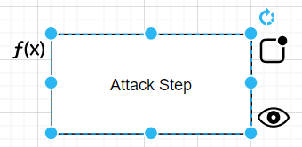

# Aggregation Functions

This plugin allows to specify an aggregation function for any shape in the diagram. The user can access the aggregation function of a cell by clicking the [handle](technical/plugin.md#ui) displayed on the right-hand side of the cell.



Aggregation functions take attributes of connected child cells and return the resulting attributes to the cell. There can be a `default aggregation function`, which will be used by default by new cells. A default aggregation function can be defined by naming a function `default` in the global **aggregation function dialog**. If no default function was specified, cells will use the `None` function and will not calculate aggregated attributes.

The aggregation function dialog allows to specify a custom aggregation function or to select a global aggregation function by reference.

## Syntax
- An aggregation function receives a `collection`, which is of type `ChildCellDataCollection` which contains a dictionary with globally defined attributes and the values of all the child cells.
  - The `GlobalAttributeDict` contains data of each `GlobalAttribute`, including min and max values.
  - The `childAttributes` object contains the attributes of the child cells which are of type `CellChildAttributes`, the `edgeWeight` (impact of the edge connecting the child) and the child's `computedAttribute` ([computed attribute](computed_attributes_functions.md)).

- An aggregation function must return an object with properties storing keys and values, which will be dispayed in the shape of the cell. (***Aggregated attributes are only rendered for attackgraph shapes, yet all shapes store them.***)

- An aggregation function must conform to the ES5 syntax as the aggregation functions are executed in a [sandboxed environment](https://github.com/NeilFraser/JS-Interpreter) with it's own js interpreter.

### Relevant data types
```ts
type ChildCellDataCollection = {
  globalAttributes: GlobalAttributeDict,
  childAttributes: ChildCellData[],
  localAttributes: CellAttributes,
}

type GlobalAttribute = {
  name: string,
  value: string,
  min: string,
  max: string
};

type ChildCellData = {
  edgeWeight: number,
  attributes: CellChildAttributes,
  computedAttribute: string,
};

type CellAttributes = { [k: string]: string };
```
### Example of an aggregation function accessing a child's attribute's value
```js
function(collection){
    return {'Name': collection.childAttributes[0].attributes['AttributeName'};
}
```
### Example of an aggregation function accessing a child's edge weight
```js
function(collection){
    return {'Name': collection.childAttributes[0].edgeWeight};
}
```
### Example of an aggregation function accessing a child's label value
```js
function(collection){
    return {'Name': collection.childAttributes[0].computedAttribute};
}
```
### Example of an aggregation function accessing global attributes:
```js
function(collection){
    return {'Name': collection.globalAttributes['AttributeName'].max};
}
```
