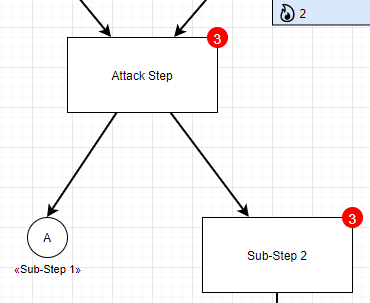
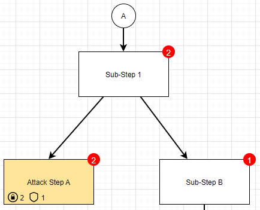

# Linking Attack Graphs

For a better comprehensibility of an attack graph and to ease modeling such graphs, this plugin allows to split an attack graph over several pages.
To do so, a new node -- a so called **link node** (white circle) -- is introduced.

Linking two attack graphs together is done by linking two link nodes together.
Each link represents an invisible edge flowing from a **source** to a **destination** link node.
Over this edge all aggregated attributes (together with their values) on the **destination** link node are synchronized with the respective **source** link node.

Link nodes behave as ordinary nodes within an attack graph with the only restriction that no computed attribute will be calculated.

## Example for a link
**Source** link node labeled as `A` and linking to page `Sub-Step 1`:

**Destination** link node labeled as `A` on page `Sub-Step 1`:

## Creating links
To create a link, first add link nodes to the two pages that shall be linked.
Connect outgoing edges from nodes to the respective **source** link nodes and inbound edges from the **destination** link nodes to the respective attack graph nodes (cf. example above).
Then, give the two link nodes that shall be connected the same label (text inside nodes).
Finally, right-click on the **source** link node, click `Edit Link...`, and select the page in the drop-down menu (2nd bullet point) that contains the **destination** link node.

To test whether the linking was successful, hover both over the **source** and **destination** link nodes.
The shown tool-tip should display the same attributes and values for the two link nodes.
